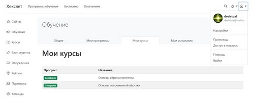
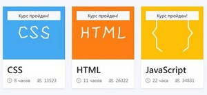
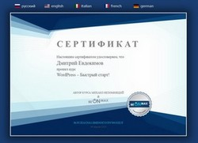

# Dmitry Evdokimov

## Contact information

* E-mail: DEVirtual@mail.ru
* Skype: devirtual@outlook.com
* Discord: DEVirtual#7550
* Telegram: @DEVirtual
* GitHub: DEVirtual

## About Me

My name is Dmitry, I am 35 years old. I have a higher technical education.

In recent years, I have been providing services in the field of information technology and engineering. I provide assistance in the administration and support of websites, deployment and configuration of CMS. I also do engineering and calculation work, processing and structuring information, writing technical articles and manuals.

I help students in writing diploma and course projects in the field of IT.

At the moment I am studying RS School JavaScript/Front-end course.

I am sure that this technical background and relevant work experience, as well as interest and desire for professional development in the field of Front-end development, will be a good starting point for entering this profession.

## Skills and Proficiency

### Hard skills (basics)

* HTML5, CSS3 and JavaScript
* BEM methodology
* Sass/SCSS
* Git, GitHub
* Node.js
* Gulp
* Figma

### Relevant hard skills

- Microsoft Word, Excel, PowerPoint, Visio, Access, Project
- MS Visual Studio (Code), SSMS, Eclipse, IntelliJ IDEA
- MS SQL Server, MySQL, Firebird, Oracle
- PHP, Open Server, Hosting services
- IBM Rational Rose, ERwin, BPwin
- WordPress, 1С- Bitrix24
- LabVIEW, Assembler

### Soft skills

+ the ability to systematize and structure the information received
+ parallel management of several projects without breaking deadlines
+ the ability to organize and plan your working time
+ ability to learn and perceive information
+ increased attention to details and minutiae
+ rapid development of new software and technologies
+ more than 10 years of remote work experience

## Code example

```
const EveryListItems = document.querySelectorAll(".any-list");

if (EveryListItems.length) {
  EveryListItems.forEach(function (EveryListItem) {
    if (EveryListItem.closest(".box")) {
      EveryListItem.classList.add("_active");
    }
  });
}
```

## Education

### University

Omsk State Technical University, Radio Engineering Faculty, specialty «Radio Engineering»

### Courses

* Hexlet. The basics of modern HTML coding

  

* Code Basics. HTML, CSS and JavaScript

  

* BeONmax. WordPress – Quick start

  

## Languages

* Russian - native
* English - A1